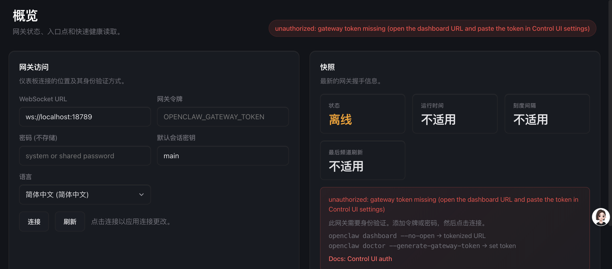
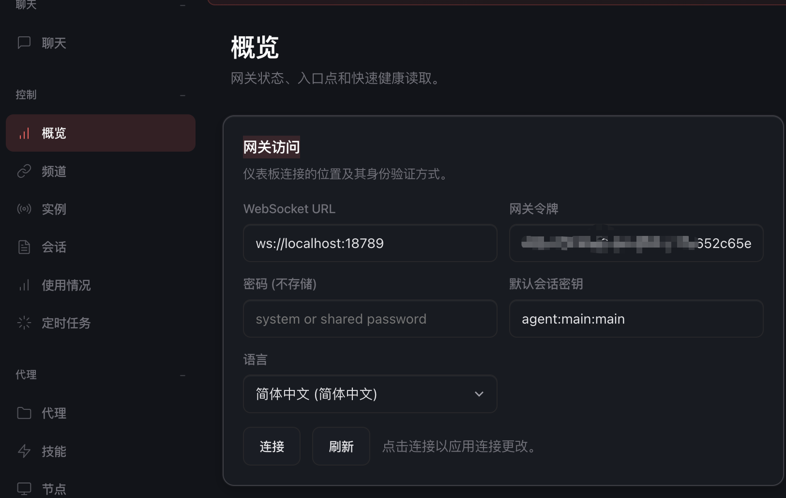

```sh 
unauthorized: gateway token missing (open the dashboard URL and paste the token in Control UI settings)
```



解决方法：

打开配置文件：  找到 gateway token。 

``` json
"gateway": {
    "port": 18789,
    "mode": "local",
    "bind": "loopback",
    "auth": {
      "mode": "token",
      "token": "e666f2838e909b9dd227fd652c65eb7fcb39ef9496c039d1"
    },
```

把它放到， UI中的概述->网关访问

