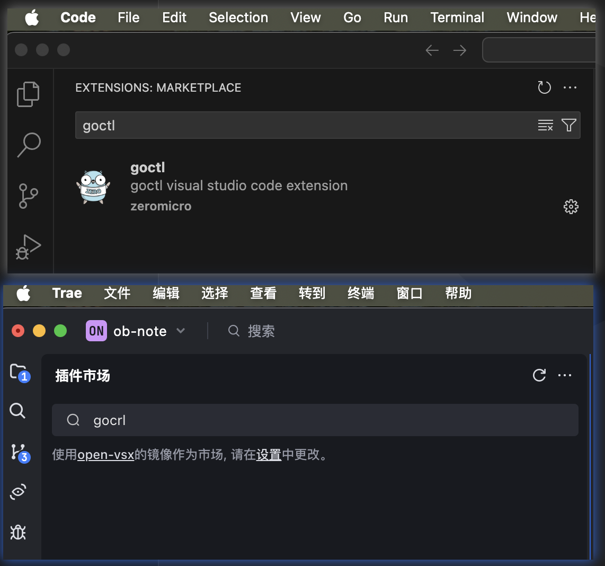
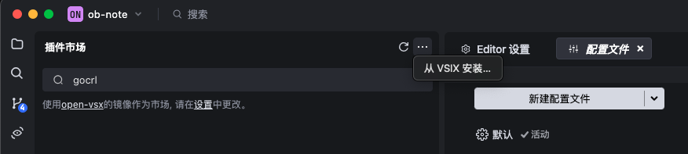

## 字节-TRAE

还是付费使用了， 首月3美元。 

官网：[https://www.trae.ai/](https://www.trae.ai/)

## 安装 open-vsx 没有插件

有一些插件， 在vscode上是搜索得到， 但是在 trae 上是搜不到的。 

如下： 



trea 使用的是 open-vsx 的 镜像做为市场。地址是:trea.ai。 为： https://open-vsx.trae.ai/ 

Open VSX 是一个由Eclipse 基金会维护的，针对Visual Studio Code (VS Code) 扩展的开源注册表。它提供了一个替代 微软的 Visual Studio Marketplace 的方案，允许用户在VS Code 中安装和使用各种扩展，并且支持自托管，方便企业在内部网络中使用。

要去 vscode 插件市场下载 [https://marketplace.visualstudio.com/vscode](https://marketplace.visualstudio.com/vscode)   


以 goctl 为例 

```
https://marketplace.visualstudio.com/items?itemName=xiaoxin-technology.goctl

```

下载模板 ： 

```sh
https://marketplace.visualstudio.com/_apis/public/gallery/publishers/${itemName.fieldA}/vsextensions/${itemName.fieldB}/${version}/vspackage
```
如： 

```sh
https://marketplace.visualstudio.com/_apis/public/gallery/publishers/xiaoxin-technology/vsextensions/goctl/0.1.10/vspackage

```

xiaoxin-technology.goctl-0.1.10.vsix 下载之后，trea 可以导入本地文件。 




本以为换一个地址就可以了，没想到这么麻烦。

那么，是不是应该写一个插件，搜索 marketplace.visualstudio.com 上的插件，然后安装即可呢？


参考资料：

1、[https://docs.trae.ai/ide/manage-extensions?_lang=zh](https://docs.trae.ai/ide/manage-extensions?_lang=zh)

2、[https://www.zhihu.com/question/10079608510](https://www.zhihu.com/question/10079608510)


